# Milano Cortina 2026 – Olympia Webapp

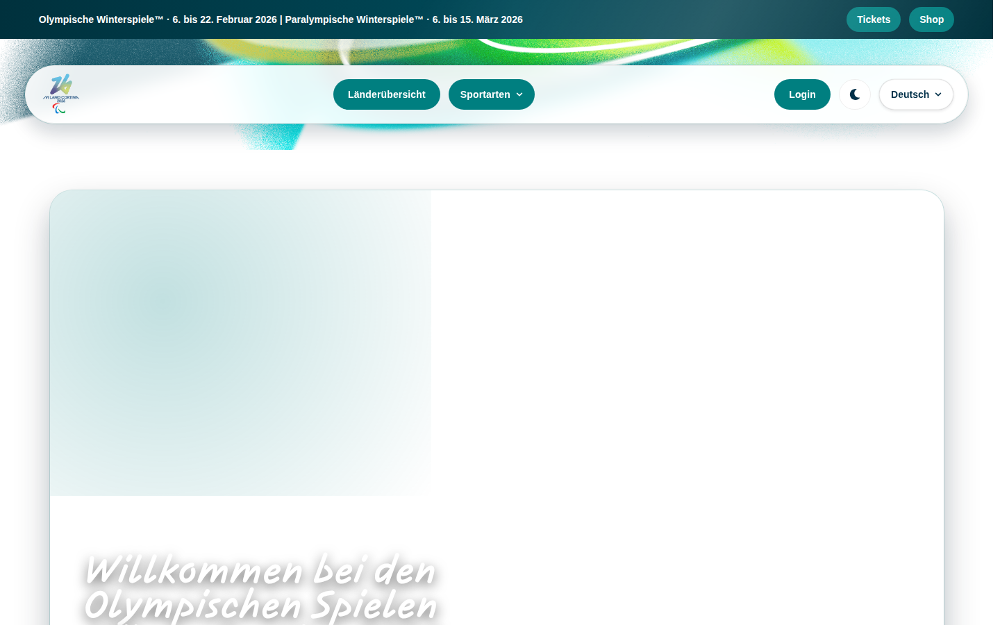

Offizielle Demo-Webanwendung für die **Olympischen Winterspiele Milano Cortina 2026**, entwickelt von **Olympia IT Solutions**. Die App stellt Informationen zu Sportarten, Ländern und Medaillen bereit und bietet ein internes Ergebnisverwaltungssystem mit 4-Augen-Prinzip, Excel-Import sowie Athleten- und Benutzerverwaltung.

🔗 **Live-Demo:** [https://olympia-it-solutions.github.io/olympia-2026-webapp/](https://olympia-it-solutions.github.io/olympia-2026-webapp/)

---

## Inhaltsverzeichnis

1. [Entwicklerdokumentation](#entwicklerdokumentation)
   - [Technologie-Stack](#technologie-stack)
   - [Voraussetzungen](#voraussetzungen)
   - [Installation](#installation)
   - [Entwicklungsserver starten](#entwicklungsserver-starten)
   - [Build & Deployment](#build--deployment)
   - [Projektstruktur](#projektstruktur)
   - [Architektur & Konzepte](#architektur--konzepte)
2. [Benutzerdokumentation](#benutzerdokumentation)
   - [Startseite](#1-startseite)
   - [Navigation](#2-navigation)
   - [Länderübersicht](#3-länderübersicht)
   - [Länderdetails & Medaillen](#4-länderdetails--medaillen)
   - [Sportarten](#5-sportarten)
   - [Login](#6-login)
   - [Schiedsrichter-Dashboard](#7-schiedsrichter-dashboard)
   - [Admin-Dashboard](#8-admin-dashboard)
   - [Cookie-Banner & Rechtliches](#9-cookie-banner--rechtliches)
   - [Dark Mode & Sprache](#10-dark-mode--sprache)
   - [404-Seite](#11-404-seite)

---

## Entwicklerdokumentation

### Technologie-Stack

| Technologie | Version | Beschreibung |
|---|---|---|
| [React](https://react.dev/) | 19.x | UI-Framework |
| [TypeScript](https://www.typescriptlang.org/) | ~5.8 | Typsichere Entwicklung |
| [Vite](https://vite.dev/) | 7.x | Build-Tool & Dev-Server |
| [Chakra UI](https://chakra-ui.com/) | 3.x | Komponentenbibliothek |
| [React Router](https://reactrouter.com/) | 7.x | Client-seitiges Routing |
| [Zustand](https://zustand-demo.pmnd.rs/) | 5.x | Globales State-Management |
| [i18next](https://www.i18next.com/) | 25.x | Internationalisierung (de, en, fr, it) |
| [Framer Motion](https://www.framer.com/motion/) | 12.x | Animationen |
| [ExcelJS](https://github.com/exceljs/exceljs) | 4.x | Excel-Import & Vorlagen-Export |
| [styled-components](https://styled-components.com/) | 6.x | CSS-in-JS Styling |
| [react-icons](https://react-icons.github.io/react-icons/) | 5.x | Icon-Bibliothek |

---

### Voraussetzungen

- **Node.js** ≥ 18.x ([Download](https://nodejs.org/))
- **npm** ≥ 9.x (wird mit Node.js mitgeliefert)
- **Git** ([Download](https://git-scm.com/))

---

### Installation

```bash
# 1. Repository klonen
git clone https://github.com/Olympia-IT-Solutions/olympia-2026-webapp.git

# 2. In das Projektverzeichnis wechseln
cd olympia-2026-webapp

# 3. Abhängigkeiten installieren
npm install
```

---

### Entwicklungsserver starten

```bash
npm run dev
```

Die Anwendung ist dann unter [http://localhost:5173/olympia-2026-webapp/](http://localhost:5173/olympia-2026-webapp/) erreichbar. Sie wird automatisch beim Speichern von Dateien aktualisiert (Hot Module Replacement).

Beim Aufruf der Root-URL `/` wird automatisch auf `/de` (Deutsch) weitergeleitet.

**Verfügbare npm-Skripte:**

| Befehl | Beschreibung |
|---|---|
| `npm run dev` | Startet den Entwicklungsserver |
| `npm run build` | Erstellt einen optimierten Production-Build |
| `npm run preview` | Startet einen lokalen Vorschau-Server für den Build |
| `npm run lint` | Führt ESLint zur Code-Analyse aus |
| `npm run deploy` | Baut und deployt die App auf GitHub Pages |

---

### Build & Deployment

#### Production-Build erstellen

```bash
npm run build
```

Der Build wird im Verzeichnis `dist/` abgelegt und ist für den Einsatz unter dem Pfad `/olympia-2026-webapp/` konfiguriert (definiert in `vite.config.ts`).

#### Auf GitHub Pages deployen

```bash
npm run deploy
```

Dieses Skript baut die Anwendung und veröffentlicht den `dist/`-Ordner auf dem `gh-pages`-Branch des Repositories. Das Deployment erfolgt über das Paket [gh-pages](https://www.npmjs.com/package/gh-pages).

---

### Projektstruktur

```
olympia-2026-webapp/
├── docs/
│   └── screenshots/            # README-Screenshots
├── public/
│   ├── locales/                # Übersetzungsdateien
│   │   ├── de/translation.json # Deutsch
│   │   ├── en/translation.json # Englisch
│   │   ├── fr/translation.json # Französisch
│   │   └── it/translation.json # Italienisch
│   ├── *.svg                   # Sport-Piktogramme (IOC)
│   └── favicon.ico
├── src/
│   ├── assets/                 # Statische Assets (Logos, Bilder)
│   ├── components/             # Wiederverwendbare UI-Komponenten
│   │   ├── ui/                 # Gemeinsame UI-Primitiven
│   │   │   ├── CTAButton.tsx   # Call-to-Action Schaltfläche
│   │   │   ├── DataTable.tsx   # Tabellen-Hilfskomponenten
│   │   │   ├── LoadingSpinner.tsx # Ladeindikator
│   │   │   ├── SectionHeading.tsx # Abschnittsüberschrift
│   │   │   ├── Surface.tsx     # Karten-/Oberflächen-Wrapper
│   │   │   └── index.ts        # Re-Exporte
│   │   ├── AthletesTable.tsx   # Athleten-Verwaltungstabelle (CRUD + Filter)
│   │   ├── Banner.tsx          # Oberes Informationsbanner (Datum, Tickets, Shop)
│   │   ├── CookieMenu.tsx      # Cookie-Einwilligungsbanner
│   │   ├── CountriesFeature.tsx# Teaser-Bereich für die Länderübersicht
│   │   ├── CountryTable.tsx    # Medaillenspiegel-Tabelle
│   │   ├── DisciplinesSection.tsx # Kachelansicht aller Sportarten
│   │   ├── Footer.tsx          # Seitenfuß mit Links
│   │   ├── FooterBanner.tsx    # Visueller Banner über dem Footer
│   │   ├── HeaderWithImage.tsx # Seitenheader mit Hintergrundbild
│   │   ├── HeroVideo.tsx       # Hero-Bereich der Startseite
│   │   ├── MedalDisplay.tsx    # Medaillenanzeige für Länder
│   │   ├── NavBar.tsx          # Hauptnavigation
│   │   ├── ResultsBySportTable.tsx # Ergebnistabelle je Sportart (Dashboard)
│   │   ├── Slider.tsx          # Bildkarussell
│   │   └── SportsTable.tsx     # Ergebnistabelle für Sportarten (öffentlich)
│   ├── debug/
│   │   └── index.ts            # DebugManager (Testmodus-Steuerung)
│   ├── i18n/
│   │   └── index.ts            # i18next-Konfiguration
│   ├── logic/
│   │   ├── rights.ts           # Authentifizierung & Rollenverwaltung
│   │   └── theme.tsx           # Dark/Light Mode (ThemeProvider)
│   ├── pages/                  # Seitenkomponenten (Routen)
│   │   ├── Accessibility.tsx   # Barrierefreiheitsseite
│   │   ├── Admin.tsx           # Admin-Dashboard (Benutzer- & Athletenverwaltung)
│   │   ├── CookiePolicy.tsx    # Cookie-Richtlinie
│   │   ├── Countries.tsx       # Länderübersicht
│   │   ├── CountryDetail.tsx   # Länderdetails & Medaillen
│   │   ├── Dashboard.tsx       # Schiedsrichter-Dashboard (Ergebnisse, Excel-Import)
│   │   ├── Login.tsx           # Login-Seite
│   │   ├── NotFound.tsx        # 404-Seite
│   │   ├── PrivacyPolicy.tsx   # Datenschutzbestimmungen
│   │   ├── SportPage.tsx       # Sportart-Detailseite
│   │   └── TermsOfService.tsx  # Nutzungsbedingungen
│   ├── services/               # API-Dienste
│   │   ├── athletes.ts         # Athleten-API (CRUD, Aktivierung)
│   │   ├── auth.ts             # Authentifizierungs- & Benutzer-API
│   │   ├── countries.ts        # Länder-API
│   │   ├── medals.ts           # Medaillen-API
│   │   ├── results.ts          # Ergebnis-API (inkl. Genehmigung, Ablehnung, Invalidierung)
│   │   └── sports.ts           # Sportarten-API
│   ├── store/                  # Zustand-Stores (Zustand)
│   │   ├── medals.ts           # Medaillen-Store
│   │   ├── results.ts          # Ergebnis-Store
│   │   └── sports.ts           # Sportarten-Store
│   ├── App.tsx                 # Haupt-App mit Routing
│   ├── index.css               # Globale CSS-Variablen & Styles
│   └── main.tsx                # Einstiegspunkt
├── eslint.config.js            # ESLint-Konfiguration
├── index.html                  # HTML-Einstiegspunkt
├── package.json
├── tsconfig.json               # TypeScript-Konfiguration
└── vite.config.ts              # Vite-Konfiguration
```

---

### Architektur & Konzepte

#### Routing

Die App nutzt **React Router v7** mit sprachbasiertem URL-Präfix:

```
/de                    → Startseite (Deutsch)
/en                    → Startseite (Englisch)
/de/countries          → Länderübersicht
/de/country/:country   → Länderdetail
/de/sports/:sportId    → Sportart-Detail
/de/login              → Login
/de/dashboard          → Schiedsrichter-Dashboard (geschützt)
/de/admin              → Admin-Dashboard (geschützt, nur Admin)
/de/cookie-policy      → Cookie-Richtlinie
/de/privacy-policy     → Datenschutzbestimmungen
/de/terms-of-service   → Nutzungsbedingungen
/de/accessibility      → Barrierefreiheit
```

#### Internationalisierung (i18n)

Alle Texte der Anwendung sind übersetzt. Die Sprache wird über das URL-Präfix gesteuert. Unterstützte Sprachen:

- 🇩🇪 **Deutsch** (`/de`)
- 🇬🇧 **Englisch** (`/en`)
- 🇫🇷 **Französisch** (`/fr`)
- 🇮🇹 **Italienisch** (`/it`)

Die Übersetzungsdateien liegen unter `public/locales/{lang}/translation.json`.

#### Authentifizierung & Rollen

Das Rechte-System (`src/logic/rights.ts`) kennt zwei Rollen:

| Rolle | Beschreibung | Zugang |
|---|---|---|
| `admin` | Administrator | Dashboard + Admin-Bereich (Benutzer- & Athletenverwaltung) |
| `referee` | Schiedsrichter | Nur Dashboard (Ergebnisse einreichen & genehmigen) |

**Login-Ablauf:** Die App versucht zunächst die REST-API (`https://olympia-2026-api.onrender.com/api/auth/login`). Schlägt dies fehl, greift im Debug-Modus ein Fallback auf lokale Testaccounts:

| Benutzername | Passwort | Rolle |
|---|---|---|
| `admin@test.com` | `admin` | Admin |
| `referee@test.com` | `referee` | Schiedsrichter |

Nach erfolgreichem Login werden Session-Daten und JWT-Token im `localStorage` gespeichert.

> **Sicherheitshinweis:** Die Speicherung von JWT-Tokens in `localStorage` ist anfällig für XSS-Angriffe. Für Produktionsumgebungen mit erhöhten Sicherheitsanforderungen empfiehlt sich der Einsatz von `httpOnly`-Cookies. Diese Demo-App nutzt `localStorage` aus Gründen der Einfachheit und da kein Server-seitiges Session-Management vorhanden ist.

#### State Management (Zustand)

Drei Zustand-Stores verwalten den globalen Zustand:

- **`useSportsStore`** – Liste aller Sportarten (aus API)
- **`useResultsStore`** – Ergebnisse je Sportart (aus API)
- **`useMedalStore`** – Medaillen je Land (aus API)

#### Backend-API

Die App kommuniziert mit einer REST-API unter `https://olympia-2026-api.onrender.com/api/`. Folgende Endpunkte werden genutzt:

| Endpunkt | Methode | Beschreibung |
|---|---|---|
| `/auth/login` | `POST` | Benutzer-Login (gibt JWT-Token zurück) |
| `/users` | `GET` | Alle Benutzer abrufen (nur Admin) |
| `/users` | `POST` | Neuen Benutzer anlegen (nur Admin) |
| `/users/{id}/deactivate` | `POST` | Benutzer deaktivieren (nur Admin) |
| `/sports` | `GET` | Liste aller Sportarten |
| `/results/by-sport?sportId={id}` | `GET` | Ergebnisse einer Sportart |
| `/results` | `POST` | Neues Ergebnis einreichen |
| `/results/{id}` | `PUT` | Ergebnis bearbeiten (nur Admin) |
| `/results/{id}/approve` | `POST` | Ergebnis genehmigen |
| `/results/{id}/reject` | `POST` | Ergebnis ablehnen |
| `/results/{id}/invalidate` | `POST` | Ergebnis invalidieren (nur Admin) |
| `/athletes` | `GET` | Alle Athleten abrufen |
| `/athletes` | `POST` | Neuen Athleten anlegen (nur Admin) |
| `/api/athletes/{id}` | `PUT` | Athleten bearbeiten (nur Admin) |
| `/api/athletes/{id}/activate` | `POST` | Athleten aktivieren (nur Admin) |
| `/api/athletes/{id}/deactivate` | `POST` | Athleten deaktivieren (nur Admin) |
| `/api/countries` | `GET` | Alle Länder abrufen |
| `/api/medals/by-country/{country}` | `GET` | Medaillen eines Landes |
| `/api/medals/table` | `GET` | Gesamter Medaillenspiegel |

#### Dark Mode

Der Dark/Light Mode wird über einen `ThemeProvider` (`src/logic/theme.tsx`) und CSS-Custom-Properties (z.B. `--bg-color`, `--card-bg`) realisiert. Die Präferenz wird im `localStorage` gespeichert.

---

## Benutzerdokumentation

### 1. Startseite


Die Startseite bietet einen Überblick über die Olympischen Winterspiele Milano Cortina 2026:

- **Info-Banner** (ganz oben): Zeigt den Zeitraum der Spiele sowie Links zu Tickets und dem offiziellen Shop.
- **Hero-Bereich**: Animierter Eingangsbereich mit dem Willkommenstext und Schnellnavigation zu den Disziplinen und Ländern.
- **Disziplinen-Sektion**: Kachelansicht der 7 verfügbaren Sportarten – klickbar, um zur jeweiligen Detailseite zu gelangen.
- **Bildkarussell (Slider)**: Automatisch wechselnde Olympia-Bilder (10 Slides, alle 5 Sekunden). Navigierbar per Pfeiltasten oder Punkte-Navigation.
- **Länder-Teaser**: Vorschau der Länderübersicht mit direktem Link zum vollständigen Medaillenspiegel.
- **Footer**: Links zu rechtlichen Seiten sowie Copyright-Hinweis.

---

### 2. Navigation

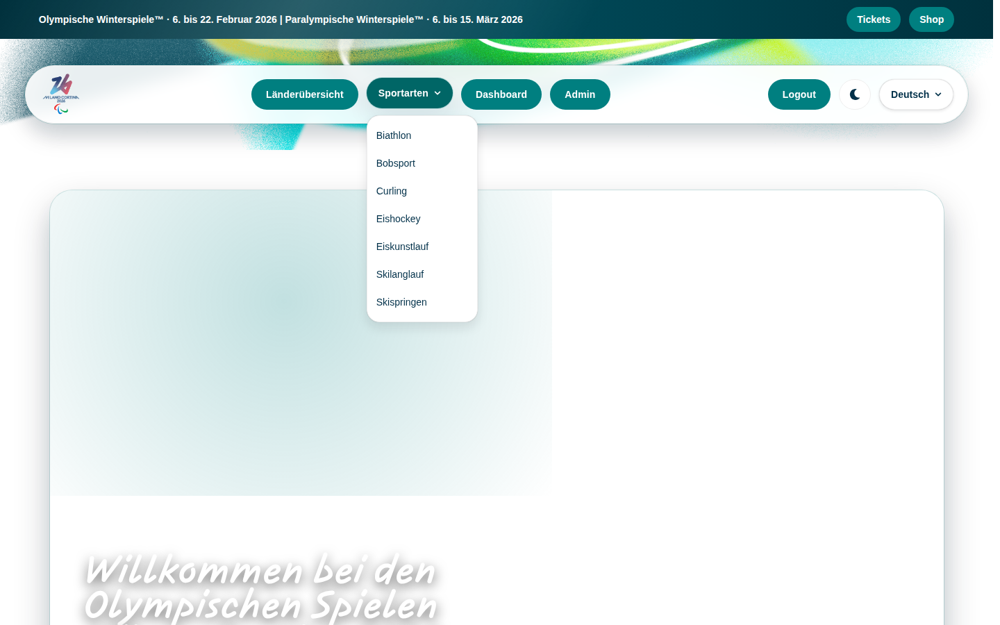

Die **Navigationsleiste** ist auf jeder Seite sichtbar und enthält:

| Element | Beschreibung |
|---|---|
| **Logo** | Klick führt zur Startseite |
| **Länderübersicht** | Öffnet den Medaillenspiegel |
| **Sportarten ▾** | Dropdown mit allen 7 Sportarten |
| **Dashboard** | Nur sichtbar nach Login (für Schiedsrichter und Admins) |
| **Admin** | Nur sichtbar für eingeloggte Admins |
| **Login / Logout** | An-/Abmelden |
| **🌙 / ☀️** | Wechsel zwischen Dark und Light Mode |
| **Deutsch ▾** | Sprachauswahl (Deutsch, English, Français, Italiano) |

Auf Mobilgeräten wird die Navigation über ein **Burger-Menü** (☰) zugänglich, das ein Slide-in-Menü öffnet.

---

### 3. Länderübersicht

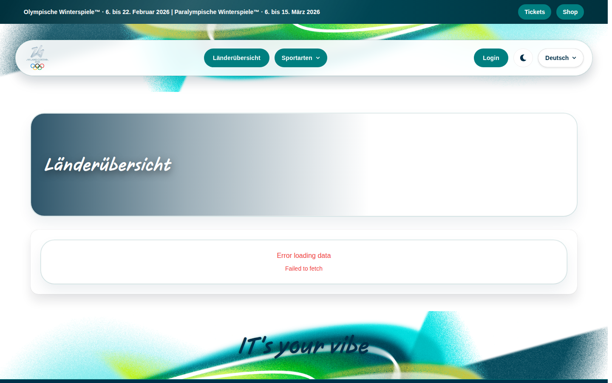

Unter `/de/countries` ist der vollständige **Medaillenspiegel** aller teilnehmenden Nationen zu finden.

- Die Tabelle zeigt **Land, Bronze, Silber und Gold** Medaillen.
- Mit **„Weitere Einträge laden"** können alle Länder angezeigt werden (Standard: 50 Einträge).
- Ein Klick auf ein Land führt zur **Länderdetailseite**.
- Die Daten werden live von der Olympia-API abgerufen.

---

### 4. Länderdetails & Medaillen

Unter `/de/country/:country` werden die **Medaillendetails eines bestimmten Landes** angezeigt:

- Übersicht der gewonnenen Gold-, Silber- und Bronze-Medaillen.
- Für jede Medaille: Name des Athleten, Sportart und Medaillentyp als Karte.
- Schaltfläche **„Zurück"** führt wieder zur Länderübersicht.
- Die Daten werden von der API geladen (`GET /api/medals/country/{country}`).

---

### 5. Sportarten

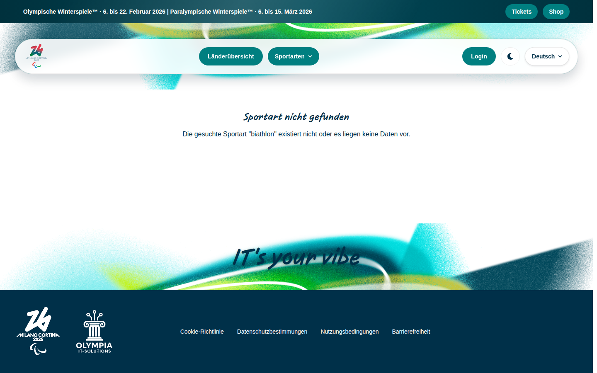

Unter `/de/sports/:sportId` wird die **Detailseite einer Sportart** angezeigt.

Verfügbare Sportarten:

| Sportart | URL |
|---|---|
| Biathlon | `/de/sports/biathlon` |
| Bobsport | `/de/sports/bobsport` |
| Curling | `/de/sports/curling` |
| Eishockey | `/de/sports/eishockey` |
| Eiskunstlauf | `/de/sports/eiskunstlauf` |
| Skilanglauf | `/de/sports/skilanglauf` |
| Skispringen | `/de/sports/skispringen` |

Jede Seite zeigt:
- **Header** mit Sportart-Bild und Titel.
- **Ergebnistabelle** mit den aktuellen Wettkampfergebnissen der jeweiligen Sportart (aus API).

---

### 6. Login

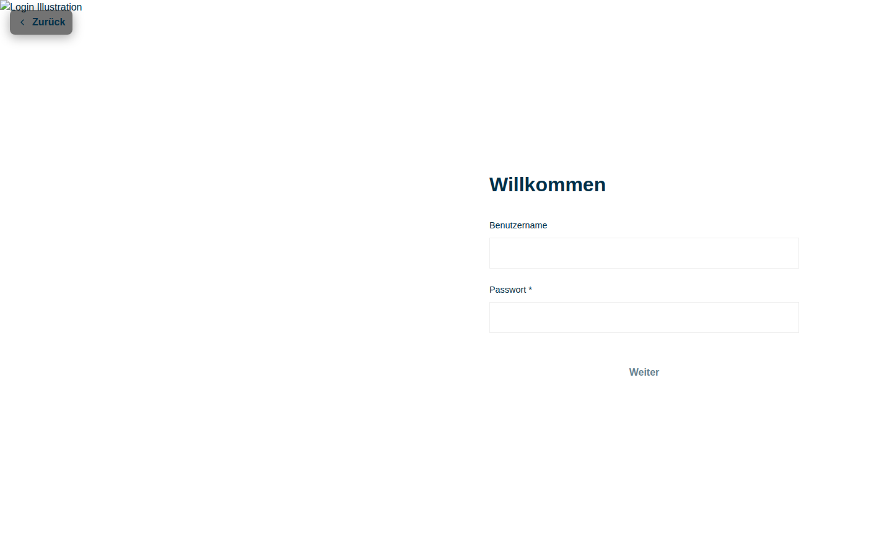

Die Login-Seite unter `/de/login` ermöglicht die Anmeldung für autorisierte Nutzer (Schiedsrichter & Admins):

- **Split-Layout**: Linke Seite zeigt ein Olympia-Bild, rechte Seite das Login-Formular.
- Eingabefelder für **Benutzername** und **Passwort**.
- Der **„Weiter"-Button** ist erst aktiv, wenn beide Felder ausgefüllt sind.
- Bei falschen Anmeldedaten wird eine Fehlermeldung angezeigt.
- Die Schaltfläche **„Zurück"** führt zur vorherigen Seite.
- Nach erfolgreicher Anmeldung wird automatisch zum **Dashboard** weitergeleitet.

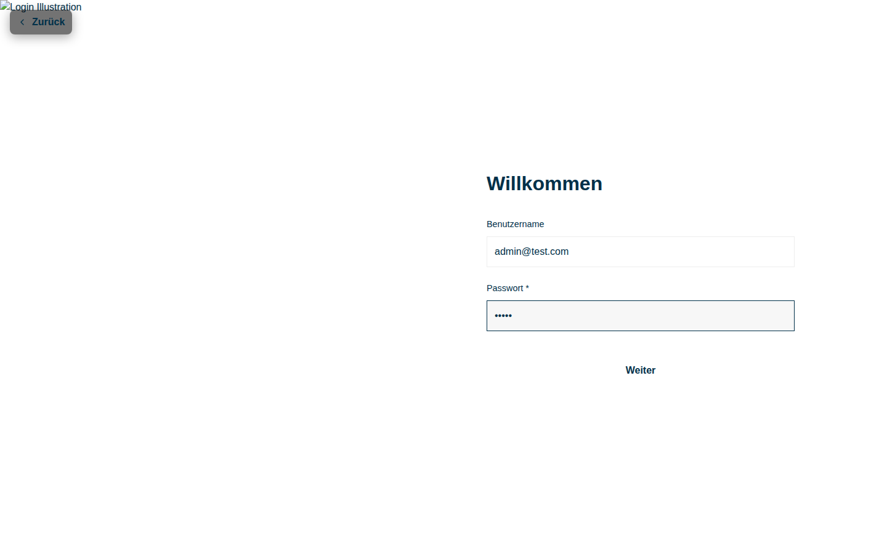

> **Testaccounts (nur im Debug-Modus, falls API nicht erreichbar):**
> - Admin: `admin@test.com` / `admin`
> - Schiedsrichter: `referee@test.com` / `referee`

---

### 7. Schiedsrichter-Dashboard

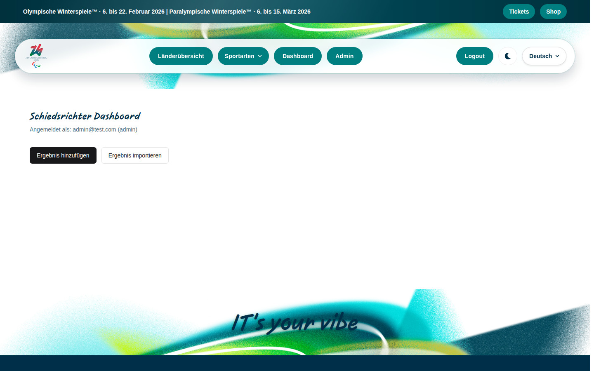

Das Dashboard unter `/de/dashboard` ist für **Schiedsrichter und Admins** zugänglich und implementiert das **4-Augen-Prinzip**.

#### Ergebnis manuell einreichen

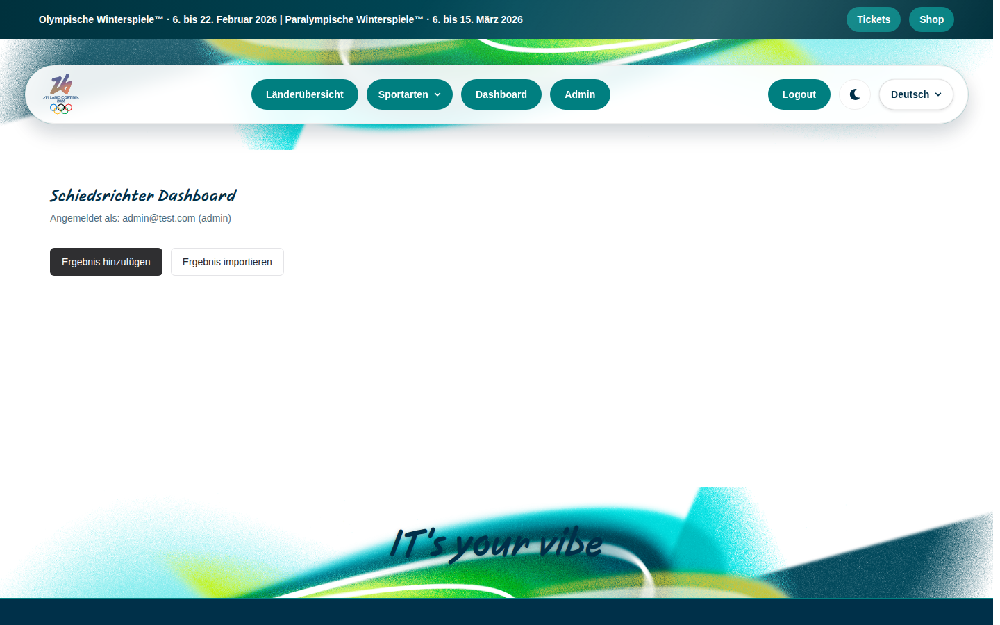

- Klick auf **„Ergebnis hinzufügen"** öffnet ein Formular.
- Auswahl von: Sportart und Athlet (aus API-Daten).
- Eingabe von: Ergebniswert (Format abhängig von Sportart) und Rang.
- Nach dem Absenden erhält das Ergebnis den Status **„Ausstehend"** (PENDING).

#### Ergebnisse per Excel importieren

- Klick auf **„Ergebnis importieren"** öffnet den Import-Dialog.
- **Excel-Vorlage herunterladen**: Lädt eine vorbereitete `.xlsx`-Vorlage mit Dropdown-Validierung für Athleten, Sportarten und Ergebnisformate herunter.
- **Datei hochladen**: Die ausgefüllte Vorlage wird analysiert und als Vorschau angezeigt.
- **Vorschau & Validierung**: Fehlerhafte Zeilen werden hervorgehoben; korrekte Zeilen können gemeinsam eingereicht werden.

#### Ergebnisstatus-Workflow

| Status | Bedeutung | Farbe |
|---|---|---|
| **PENDING** | Eingereicht, wartet auf Genehmigung | 🟡 Gelb |
| **APPROVED** | Von einem anderen Benutzer freigegeben | 🔵 Blau |
| **PUBLISHED** | Öffentlich sichtbar | 🟢 Grün |
| **REJECTED** | Abgelehnt (z. B. fehlerhafter Eintrag) | 🔴 Rot |
| **INVALIDATED** | Nachträglich als ungültig markiert | ⚫ Grau |

#### 4-Augen-Prinzip

- Ein Schiedsrichter **kann seine eigenen Einreichungen nicht genehmigen** – eigene Einreichungen werden als „Eigene Einreichung" markiert.
- Erst nach Genehmigung durch eine andere Person kann das Ergebnis **veröffentlicht** werden.
- Admins können genehmigte und veröffentlichte Ergebnisse nachträglich **invalidieren**.

#### Tabelle der eingereichten Ergebnisse

Zeigt alle Ergebnisse der ausgewählten Sportart mit: Athlet, Einreicher, Land, Ergebniswert, Medaille, Status und Aktionsbuttons.

---

### 8. Admin-Dashboard

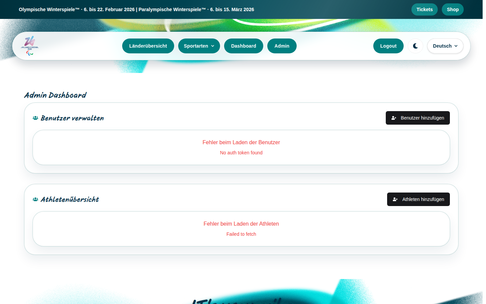

Das Admin-Dashboard unter `/de/admin` ist ausschließlich für **Administratoren** zugänglich und besteht aus zwei Bereichen: **Benutzerverwaltung** und **Athletenverwaltung**.

#### Benutzerverwaltung

- Übersicht aller registrierten Benutzer mit: Benutzername, Name, Rolle (ADMIN / REFEREE) und Status (aktiv / inaktiv).
- **Filter & Suche**: Benutzer nach Name, Rolle oder Status filtern.
- **Sortierung**: Klick auf Spaltenköpfe sortiert die Tabelle.
- **„Neuer Benutzer"**: Formular zum Anlegen eines Benutzers (Name, Benutzername, Passwort, Rolle).
- **Deaktivieren**: Einzelne Benutzer können deaktiviert werden (statt gelöscht).

#### Athletenverwaltung

- Vollständige Übersicht aller Athleten mit: Name, Land, Sportart und Status.
- **Filter & Suche**: Athleten nach Name, Sportart, Land oder Status filtern.
- **Sortierung**: Klick auf Spaltenköpfe sortiert die Liste.
- **„Neuer Athlet"**: Formular zum Anlegen eines Athleten (Name, Sportart, Land).
- **Bearbeiten**: Athletendaten können direkt aktualisiert werden.
- **Aktivieren / Deaktivieren**: Status eines Athleten kann umgeschaltet werden.

---

### 9. Cookie-Banner & Rechtliches

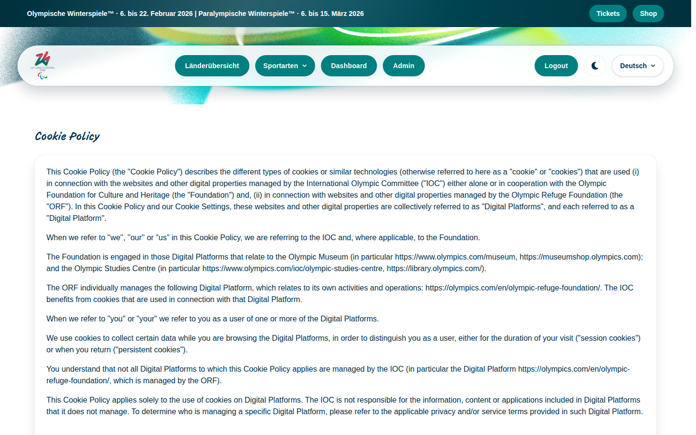

Beim ersten Besuch erscheint am unteren Bildschirmrand ein **Cookie-Banner**:

- **„Alle akzeptieren"**: Akzeptiert alle Cookies.
- **„Optionale ablehnen"**: Akzeptiert nur notwendige Cookies.
- Die Einwilligung wird in der Session gespeichert.

Im **Footer** sind folgende rechtliche Seiten verlinkt:

| Seite | URL |
|---|---|
| Cookie-Richtlinie | `/de/cookie-policy` |
| Datenschutzbestimmungen | `/de/privacy-policy` |
| Nutzungsbedingungen | `/de/terms-of-service` |
| Barrierefreiheit | `/de/accessibility` |

---

### 10. Dark Mode & Sprache

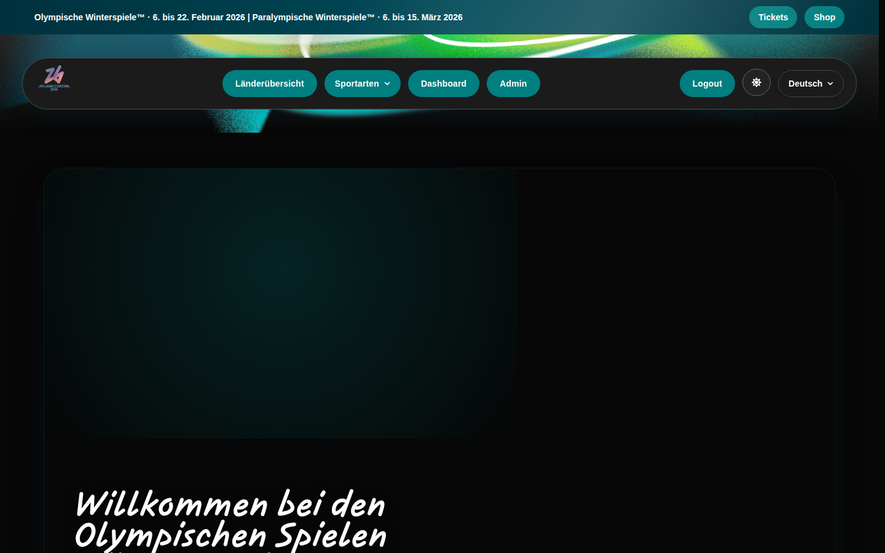

#### Dark Mode
- Der Dark/Light Mode wird über das **Mond-/Sonnen-Symbol** (🌙/☀️) in der Navigation umgeschaltet.
- Die Einstellung wird im Browser (`localStorage`) gespeichert und beim nächsten Besuch wiederhergestellt.
- Alle Seiten und Komponenten unterstützen beide Modi vollständig.

#### Sprachauswahl
- Die Sprache kann über das **Sprachdropdown** in der Navigation gewechselt werden.
- Die URL-Sprache wird dabei aktualisiert (z.B. `/de` → `/en`).
- Unterstützte Sprachen: **Deutsch, Englisch, Französisch, Italienisch**.

---

### 11. 404-Seite

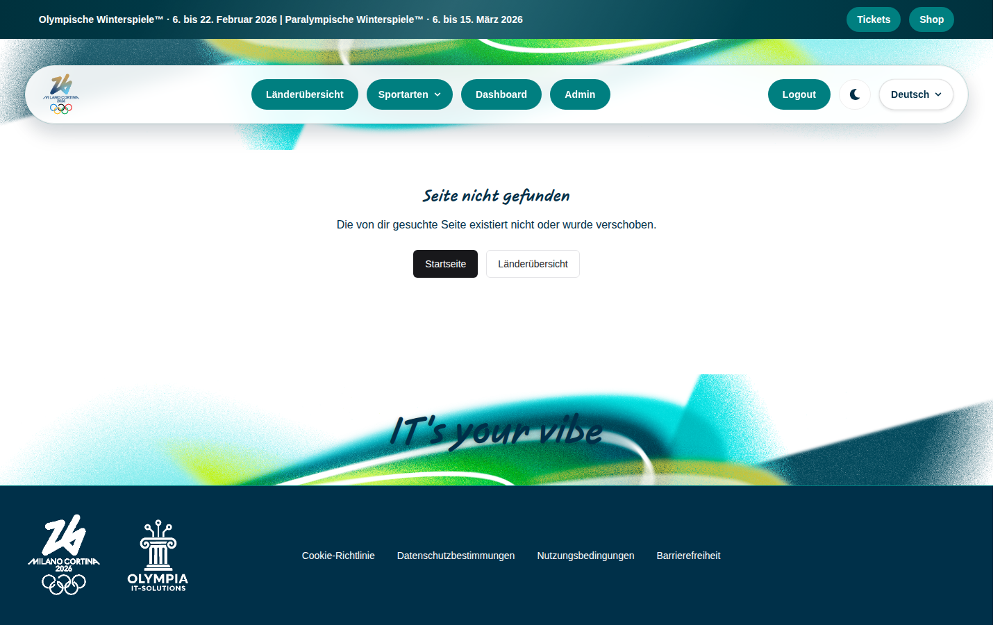

Bei Aufruf einer nicht vorhandenen URL wird die **404-Seite** angezeigt:

- Klare Fehlermeldung: „Seite nicht gefunden".
- Schaltflächen **„Startseite"** und **„Länderübersicht"** ermöglichen eine schnelle Navigation zurück.

---

## Lizenz

Copyright © 2026 Olympia IT Solutions. Alle Rechte vorbehalten.

